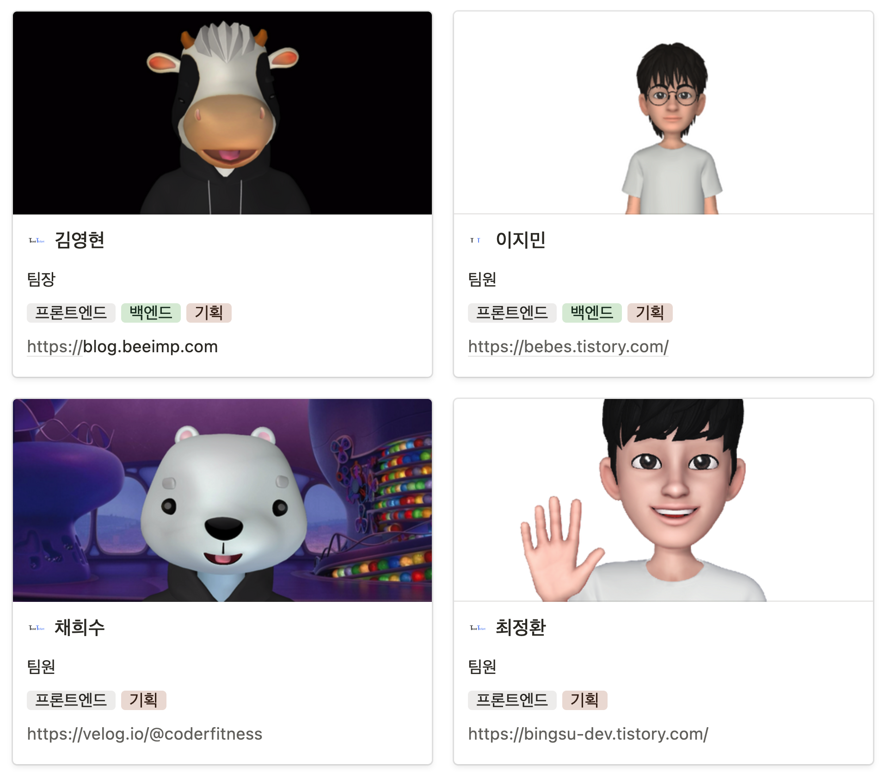
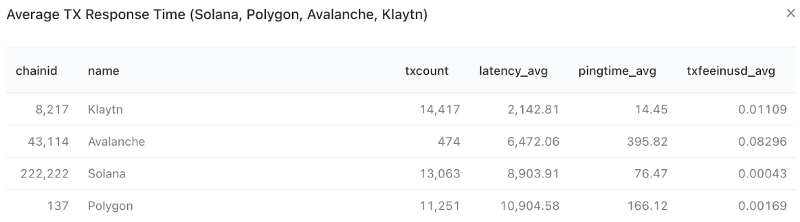
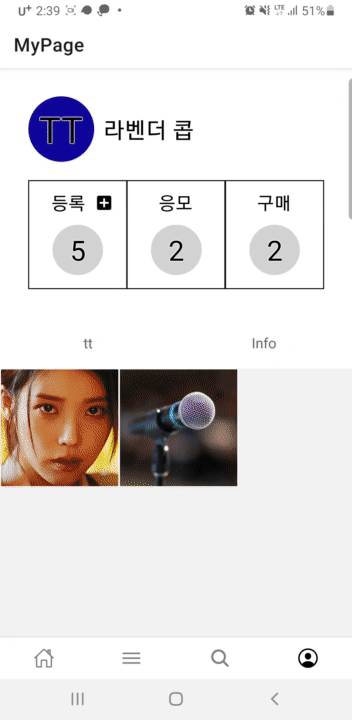

# TT Project - ZeroTEB

## 프로젝트 개요

### TT 란 ?

> **누구(Who)도 신뢰하지 않는 Klaytn 기반 티켓팅 서비스**

Trust Ticket, TT는 블록체인 기술을 이용한 티켓팅 서비스를 제공합니다.  
TT 이용자는 이벤트를 기획할 수도 있고, 다른 이벤트를 참여할 수 있습니다.
이벤트 참여를 하면 각 이벤트에서 발행하는 토큰을 받을 수 있고, 이는 입장티켓 또는 응모당첨권으로 사용합니다.

## [팀원 소개](https://www.notion.so/aec4ec3169d64e9385e04677cf6f699d)

## 기술 스택

### Back-end

- Languege - TypeScript
- Core -Nest.js, Express.js
- DB - MongoDB, Mongoose(ORM)

### Front-end

- Mobile
  - Languege - TypeScript
  - Core - React-Native, Expo
  - 상태관리 - Redux, redux-toolkit
- Web
  - Languege - TypeScript
  - Core - Next.js, React.js
  - 상태관리 - Redux, redux-toolkit
  - Style - emotion, mui

### Blockchain

- Languege - Solidity
- Core - Klaytn
- IPFS - Pinata
- Tools - Hardhat
- Wallet - Kakao Klip

### 프로젝트 관리

- 코드 관리 - GitHub, eslint, prettier
- 협업 도구 - Figma, Notion, Discord

## 3. 프로젝트 소개

### 왜 필요한가요?

- 이벤트가 돌연 취소
  - 상황 - 소비자는 이벤트 기획측 또는 플랫폼에서 알 수 없는 이유로 콘서트 취소에 대해 일방적인 통보를 받았습니다.
  - 문제 - 소비자는 일방적인 통보를 받았음에도 보상을 받을 수 없습니다.
- 티켓 사재기
  - 상황 - 암표상들은 개인의 이익을 위해 이벤트에서 티켓을 구매 후 몰래 재판매합니다.
  - 문제 - 암표상들은 공정한 티켓 획득 기회를 미리 사재기를 하여 웃돈을 붙여 표를 판매하기 때문에 위법하다고 할 수 있습니다.
- 플랫폼의 서비스 종료
  - 상황 - 이용하던 거래 플랫폼이 어떠한 이유로 유지할 수 없어 서비스를 종료했습니다.
  - 문제 - 이용하던 거래 플랫폼 서비스가 종료되면서 소비자의 모든 기록이 삭제되면서 지금까지의 활동이 확인할 수 없습니다.
- 각 플랫폼의 제약
  - 상황 - 이용하던 거래 플랫폼이 아닌 타 거래 플랫폼을 이용한다.
  - 문제 - 타 거래 플랫폼에서는 이전에 이용하던 거래 플랫폼에서 참여했던 콘서트 내역을 가져올 수 없거나 참여했던 실물 콘서트 티켓을 모두 등록해야하는 불편함을 가집니다.

### 무엇을 얻을 수 있나요?

- 소비자는 이벤트가 갑자기 취소되더라도 티켓 가격의 103%를 보상 받을 수 있습니다.
  - 이벤트 기획자는 이벤트를 등록하면서 티켓으로 판매하여 얻을 수 있는 총액의 5%(보증금 3%, 수수료 2%)를  지불합니다.
    - 보증금은 이벤트 성공시 이벤트 기획자에게 반환됩니다.
    - 수수료는 주로 컨트랙트 실행, 서버 유지비에 사용됩니다.
  - 이벤트가 최소되면 소비자는 대해 티켓의 103%를 보상 받습니다.
    - 이벤트 기획자의 보증금이 피해 보상금으로 사용합니다.
- 소비자는 공정한 티 켓케득 기회를 얻을 수 있습니다.
  - 이벤트가 종료될 때까지 토큰 거래가 불가능합니다.
    - SBT와 NFT를 적절히 사용하여 참여에 대한 티켓의 주요 목적을 달성합니다.
- 소비자는 이용하던 티켓 플랫폼이 종료되더라도 모든 기록을 잃지 않습니다.
  - 데이터베이스가 손상되더라도 Klaytn Network에서 복구 가능합니다.
  - 만약, 해당 플랫폼의 서비스가 종료되더라도 모든 기록은 Klaytn Network에 투명하게 저장되어 토큰형 티켓의 거래 또는 확인이 가능합니다.
- 이벤트 기획자는 이용하던 여러 티켓 플랫폼이 통합적으로 VIP를 관리할 수 있습니다.

### 누가 할 수 있나요?

- 카카오 계정이 있다면 누구든 사용 가능하고 누구든 될 수 있습니다.

### 언제, 어디서 사용할 수 있나요?

- 모바일 기기에 종류에 상관없이 언제, 어디서든 이용 가능합니다.
  - React-Native로 앱이 제작되어 Android, ios에 상관없이 사용 가능합니다.
- 언제, 어디서든 이벤트를 등록할 수 있습니다.
  - PC, Mobile 모두 지원합니다.
- 언제, 어디서든 티켓을 구매, 응모, 인증, 확인 가능합니다.

### 어떻게 사용할 수 있나요?

1. 카카오톡 앱을 설치합니다. ( 이미 다 있으실 거에요 )
2. 앱 서비스에서 클립을 가입합니다.
3. TT 앱을 설치합니다. ( 앱 스토어, 플레이 스토어 등 배포 예정입니다! )
4. TT 앱을 실행하여 이벤트 등록부터 티켓 구매, 응모, 조회, 인증, 확인까지 자유롭게 이용 가능합니다.

## Klaytn 사용한 이유

- 카카오 클립으로 누구나 간단하게 지갑 생성 가능합니다.
  - 복잡한 지갑 생성 과정을 거치지 않고, 국민 메신저 서비스로 자리 잡은 카카오톡 앱이 있다면 사용 가능한 클립을 사용하기 위해 채택했습니다.
- 속도와 가격 측면에서 용이합니다.
  - 가격 - 트랜잭션에서 발생하는 가스비가 1~20원 수준으로 매우 저렴합니다.
  - 속도 - 이론적 측면이 아닌 실제 4000 TPS의 처리량을 가집니다.

  

### WorkFlow

## **기능별 시연 영상**

### 랜딩 페이지 (WEB)

  

### Klip 로그인

- Klip을 이용한 개발

    현재 Klip API에서 테스트 넷을 지원하지 않습니다. 그래서 Klip의 일부 기능들을 서버에서 구현하여 Klip API의 역할을 대체합니다.

    Klip에서 request key를 받아 서버로 전송하고, 서버에서 Klip과 통신해서 사용자를 인증합니다. 인증된 사용자에게 JWT 토큰을 발행하여, TT의 기능을 사용할 수 있도록 합니다.

    .gif)

### 이벤트 등록(모바일)

- 간편한 이벤트 등록

    스마트폰으로 간단하게 이벤트를 등록할 수 있고, 많은 데이터를 등록하는 사람들을 위해 웹으로도 등록할 수 있습니다.

- 토큰 발행

    이벤트가 등록되면, 컨트랙트는 토큰을 서버에 발행합니다. 발행된 토큰은 구매를 통해 얻을 수 있습니다.

    

- 이벤트 등록(웹)

    

    

### 이벤트 티켓 구매/응모

- 티켓 구매

    서버는 티켓을 구매한 사용자에게 티켓을 전송합니다. 사용자가 쉽게 구매할 수 있도록 Klip API를 사용하여, 편의성을 높였습니다.

- 티켓 응모

    응모한 사용자의 주소를 컨트랙트에 보관합니다. 이벤트 응모 가능 기간이 지나면 서버가 자동으로 이벤트 추첨을 컨트랙트에 요청합니다. 이벤트 추첨은 응모자 중 랜덤으로 당첨자를 선정합니다.

    .gif)

### QRcode 생성

- 간편한 티켓 생성

    QR 코드는 앱에서 티켓을 클릭할 때 발행되고, 서버는 해당 QR에 유효 기한을 부여합니다. QRcode는 nonce 데이터를 가지고 있습니다.

    .gif)

### QRcode 유효성 확인

- 티켓 확인하기

    QR Reader는 QRcode에서 읽은 데이터(nonce, event_id)를 서버로 전송합니다.

    서버는 해당 이벤트의 QRcode인지, 유효 기한이 남았는지 검사합니다.

    .gif)

### 검색

- 원하는 이벤트 찾기

    사용자는 Keyword가 포함한 이벤트를 검색할 수 있습니다.

- 인기 있는 이벤트 (개발 진행 중)

    사용자가 검색한 키워드 중 검색 결과가 유효한 데이터를 DB에 저장합니다.

    이후 같은 키워드가 들어오면 count값을 올려주고, count가 가장 많은 키워드를 인기 검색어로 정합니다.

    .gif)

### 내 주변

- 나와 가까운 이벤트 찾기

    현재 위치의 좌표를 서버로 보냅니다. 서버는 Map API를 통해 사용자의 지역을 찾고, 이벤트의 좌표와 거리를 구해 사용자에게 출력해 줍니다.

    .gif)

### 관련 문서

- [API Document](https://documenter.getpostman.com/view/21835071/UzQvtjyt)

- [시나리오 기반 WorkFlow](https://www.figma.com/proto/EiawCKjCRga7uzldcSx5fu/ZeroTEB_Architecture?node-id=85%3A2&scaling=min-zoom&page-id=0%3A1)

- [App Prototype](https://www.figma.com/proto/ISnNAWq8EU68Np1WNlIS3P/ZeroTEB_Mockup?node-id=5%3A6&starting-point-node-id=5%3A6)
